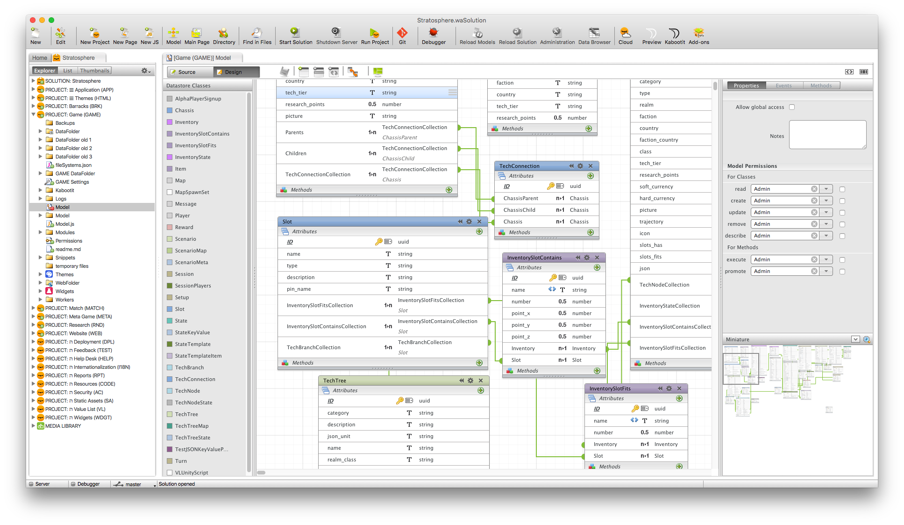
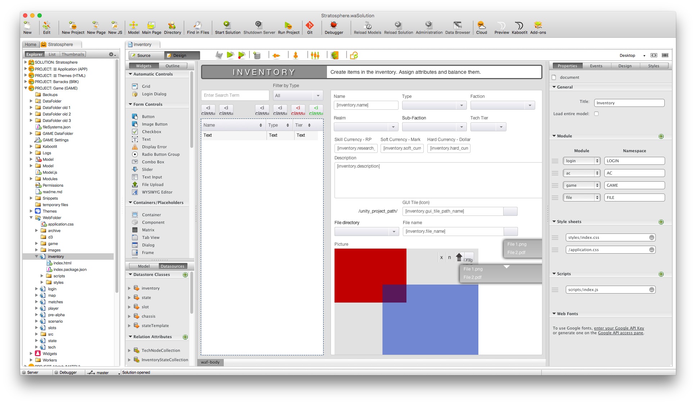
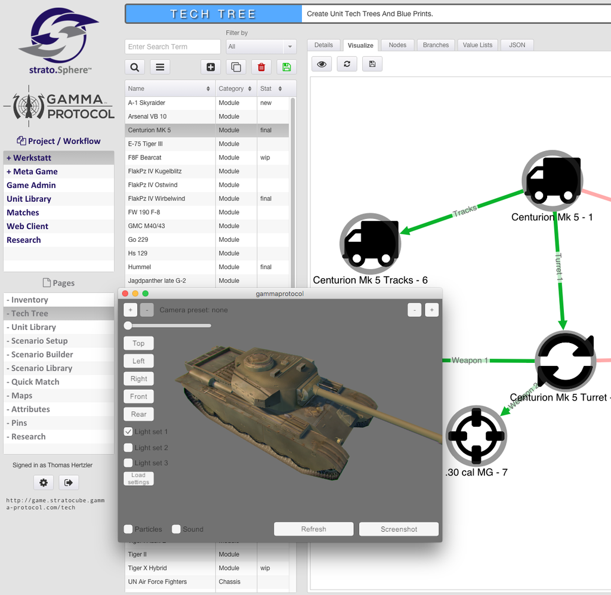
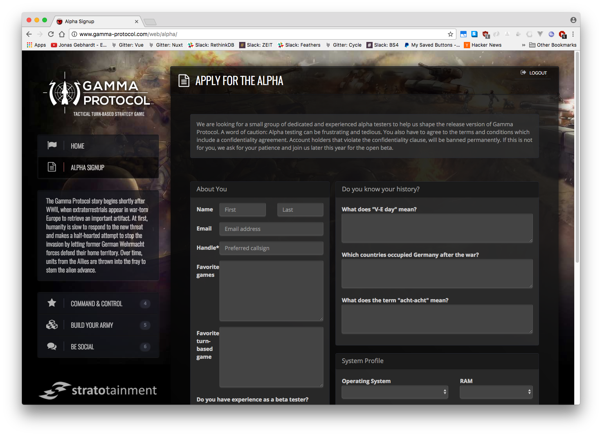

# Data Sutra for Wakanda

 

An application platform for Wakanda.

> This is code for "Old" Wakanda which was abandoned mid 2015 by [4D](http://www.4d.com/)

- [Documentation](https://datamosaic.github.io/data-sutra-wakanda/documentation/)

## Related projects

### "Old" Wakanda Sources

- [Wakanda Server](https://github.com/Wakanda/core-Wakanda)
- [Wakanda WAF](https://github.com/Wakanda/WAF)
- [Widgets for Wakanda](https://github.com/Wakanda-Packages/wakanda-widgets)
- [Studio Extensions for Wakanda](https://github.com/Wakanda/wakanda-extensions)

## Screenies

1. Model editor

2. UI editor

3. Internal UI

4. External UI

