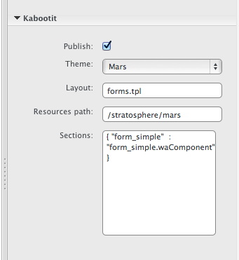

Pages
=====

<!-- toc -->

A “Kabootit page” defines the starting point for the Kabootit build
process. Meta data associated with the page defines whether a page is
published, what the theme template to use for the build, what section
files to map to template tags, etc.

Development process
-------------------

Once you have at least one theme template created, you can start
creating Kabootit pages.

1.  Create a Wakanda page in the `src/pages` directory (you may have to
    use the file menu to do this)
2.  Set up the Kabootit meta data in the pages property pane

Meta data
---------

1.  *Title*: we use the default Wakanda title property to fill in the
    meta title tag
2.  *Publish*: quick way to toggle whether a page is built or not.
3.  *Theme*: name of the theme.
4.  *Layout*: name of the theme layout file (.tpl file in
    `{{project}}/WebFolder/src/templates` directory or
    `{{Themes}}/{{client}}/{{themeName}}/templates` directory)
5.  *Resources path*: typically something along the lines of
    `../themes/<theme folder name>`
6.  *Sections*: use a json object to specify all section tags in the
    theme layout

The associated page `Resources path` data point looks like this
`/stratosphere/mars` (`/{{theme name}}/{{theme directory}}`)

Templates can either be stored in the theme or in projects. Templates
stored in the theme are available to all projects while templates stored
in project are only available to that project.

The page `Resources path` data point looks like this for:

-   theme location
-   project location

