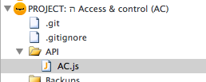

API
===

<!-- toc -->

API’s allows projects to publish functionality to SSJS and on up the
food chain to CSJS. API functionality is not required to be scoped
around data class objects like how default Wakanda approach uses.
Instead, API is generally organized around business objects. Business
objects can be any combination of class objects and workflows small or
large.

The use of API to “publish” functionality means that the client should
never directly access data storage directly. This does not mean that
there is no functionality written at the class object level—just no
business or UI logic is at the class object level. Class object
functionality is reserved for keeping persistent data structures and
data requirements square.

Incoming Changes
----------------

- versioning

- api class setup (with security code injection to make calls as
similar as possible between external and internal)  
- developer key for external validation

External
--------

- post

- url:
http://base\_url.com/projectNameSpace/api/1/node/node/node(etc)/action

- header: Content-type: application/json  
- body: json objects with developer token and arguments

Using same endpoint as cross-project xhr talk but with a developer token
(and host) whitelist. (Localhost and whitelist requests go through.)

Setup
-----

1.  create a folder in the top level of the project called `API`
2.  create a javascript file in the `API` folder with the name of the
    project’s identifier



Boilerplate
-----------

Any number of javascript design patterns can be used to structure the
API.js file(s). Based on the fact that there can be be public and
private methods accessed from both the project itself and outside the
project, we have gravitated towards one api top level file that uses:

1.  object literal for the public methods
2.  section for private functions, variables and CONSTANTS
3.  `module.exports` setup code to use in the same project via CommonJS
    pattern
4.  `controller` function to handle xhr requests from other projects

Work in progress boilerplate:

```js
/**
    * Public API variable
    */
var AC = {};


/**
    * internal: use as a module
    */
var module = module || new Object();
if (module && module.exports) {
    module.exports = AC;
}


/**
    * external: request handler comes in here
    */
function controller (request, response) {
    debugger;
    var 
        method,
        results;

    // TODO: go to access and control module to authenticate client request

    // if AC authenticated
    var authenticated = true;
    if (authenticated) {
        currentSession().promoteWith('Code');

        // TODO: based on request params, call a method generically (no CASE!)
        // if multilevel deep, call correctly
//      var results = AC[method](request);

        results = AC.organization.getAll(); // example

    }
    else {
        // TODO: if not authenticated
        // TODO: use error module with error object
        return "some error"
    }
    return results;

};


/**
    * API: public methods
    */
AC.organization = {};

AC.organization.getAll = function get() {
    return ds.Organization.all();
};


/**
    * Private functions, variables and CONSTANTS
    */
function anonymous(xx) {


}
```

Request handler
---------------

The key for exposing API to other projects is have a request handler
route all external xhr requests through to the `controller` method in
the API. Add the following to each project’s bootstrap.js file (switch
out the name spacing):

```js
addHttpRequestHandler(
        '/api/\.\*',
        'API/AC.js', 
        'controller' 
);
```