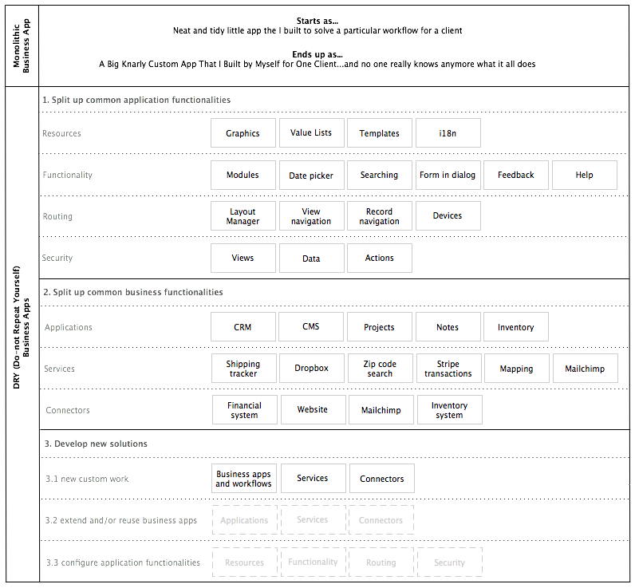

Architecture
============

<!-- toc -->

Solutions created with Kabootit are made up of many reusable pieces and
a few custom pieces. Reusable pieces can optionally be connected
together enabling many Kabootit applications to be easily upgraded and
maintained. (See \[\[GIT\]\].)

The difference between a monolithic solution and a DRY (*Do not Repeat
Yourself*) Kaboot solution is illustrated as follows:

Concepts
--------

Organizing projects into dedicated business or application
functionalities is achievable right now with the various plumbing
abilities of Wakanda server (xhr, request handlers, RCP, REST, etc).

The trick is to wire projects up in such a way that they talk to each
other through well defined interfaces so you don’t end up with spaghetti
code all over the place. Done correctly, you can even achieve a git
setup (with submodules) where you can keep the structure and logic of
projects connected between many solutions while keeping the data
localized. A few steps and we have a new client solution up and running
from repo to developer machines through to staging server with all
common projects linked in.

Benefits
--------

Major benefits are achieved from this layers structure.

1.  updating, modifying or improving the functionality in one layer does
    not directly affect other layers
2.  interfaces between layers is simple in expectations and returns
3.  security is implied and strengthened by restricting layers to
    interact only with their adjacent layers
4.  debugging issues is an ordered process
5.  you can use any database just as easily as Wakanda’s
6.  easy to implement complex transactions
7.  freed from event chaining/firing headaches
8.  runtime security management per SaaS

Issues with monolithic apps
---------------------------

Monolithic apps are not inherently bad. They just become bad when you
try to make them scale and do more than a few things:

1.  bolting on security, visibility and functionality to core classes
    via all the various meta data points is repetitive
2.  data format in structured wakanda classes doesn’t usually mirror UI
    representation and thus needs to be “marshaled”
3.  sometimes the client needs to send multiple async calls to get
    something done
4.  wakanda’s default REST URL structure not necessarily what a widget
    sends
5.  wakanda’s default REST is hard to lock down granularly and know what
    is going on and who can do what and see this or that
6.  multi project data access only exposes data, not methods

By “bad” I mean “creates technical debt”, “slow”, “spaghetti code”,
“hard to maintain”, “hard to debug”, “lots of downtime”, “untestable”,
“insecure”, etc. Technical debt can be managed up to a certain point in
monolithic apps with various techniques such as refactoring, brute
force, and weekends spent at the office.

  []: Kabootit_DRY_architecture.png