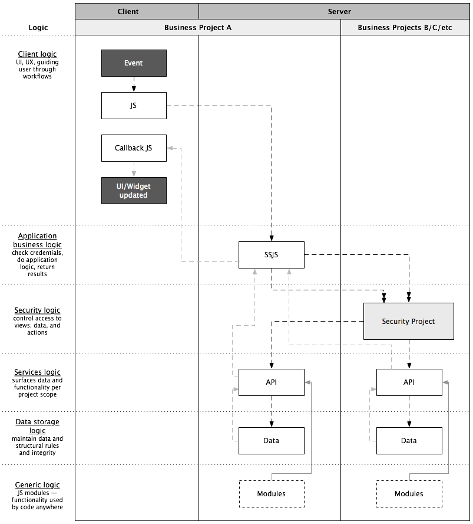

Logic Flow
==========

Wakanda’s default data layers has a lot of features: classes, relations,
collections, entities, permissions, events, and methods. Client requests
go directly to the data layer at which point everything is figured out
per request. Really easy to get started with and use.

However to scale to many solutions, many developers, many clients — all
with various common projects — you have to “unpack” all of the Wakanda
functionalities built into the data layer and assign them to their own
layers, each focused on one task. These layers build on each other and
some specific project functionalities (ex: security project) to give an
ordered flow for application logic — from client all the way to discrete
data — to pass through:

1.  **Client-side methods**: never do application logic…always call ssjs
    methods instead. only do UI logic at this level and handle any ssjs
    errors returned (note: only local datasources used)
2.  **SSJS methods**: check credentials, do application logic, return
    results (data, success or error) to client in correct format. always
    access other projects via their api’s, never directly to datastores
3.  **Security**: sits at the solution level (security project).
    projects publish security rules, security project is used to assign
    to groups, ssjs methods check AC api before going to project api
    layer
4.  **Project API’s**: sits on top of structured data and reveals how
    structured data is consumed and interacted with. usually packaged in
    business logic perspective or UI data requirements perspective, not
    structured data perspective
5.  **Projects**: structured business units. often contain UI’s to
    manage structured data (also starting at client layer, never direct
    to data classes)
6.  **Data classes**: basic structured relational data and rules to
    maintain data integrity. not worried about how it is accessed or how
    to format or whatever. security is locked down by default and data
    access is only through the project api server-side

This explicitly defined pathway for flow of logic and data enables
Wakanda projects to act autonomously, share data and services to other
projects in a solution, be developed and maintained independently of the
current solution, and even be connected/shared with multiple solutions
(see \[\[GIT\]\]).

No matter how much code you add over time, architecture doesn’t become
more complex. Code remains predictable, maintainable and understandable.

*Test 1: a new programmer can find there way around, get up to speed,
and be productive fast.*  
*Test 2: you can make changes to code and trust that it doesn’t affect
other code.*  
*Test 3: code does not get more fragile over time.*  
 

