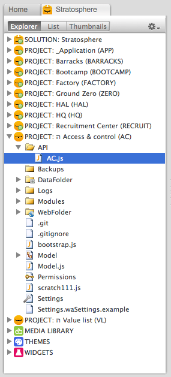

Organization
============

<!-- toc -->

Apache Gateway Server
---------------------

We front everything with an Apache server to serve as a “gateway” to all
Wakanda servers. This gives us a number of features that aren’t easily
doable by hitting Wakanda servers directly:

-   default status of all resources is closed to the outside world
-   use the `mod_proxy` (url rewrite) module to normalize URL’s
-   run many Wakanda servers—and hence solutions—transparently on one
    server machine
-   cache commonly used resources
-   fail-over and hot-swap between duplicate server instances

The gateway server is also an important piece of our [continuous
integration] workflow.

Solution
--------

A Wakanda solution represents a single instance of a deployed
application on a Wakanda server. Currently, only one solution can be
deployed per Wakanda server.

A Wakanda solution can contain many projects and resources in file
system objects such as modules, themes and media.

We also store various custom settings files at this level that we access
from our extensions and development workflows (ex: the bootstrap
builder).

Projects
--------

Projects are port specific organizational containers that encapsulate
public resources (ie, “WebFolder”), persistent data storage, and all
supporting functionalities and logic necessary for whatever workflows
are implemented by a particular project. At minimum there must be one
project per solution.

While you can implement any number of workflows in a given project, our
best practice is to organize projects into dedicated business or
application functionalities for reuse. This concept is covered in detail
[here].

  [continuous integration]: http://en.wikipedia.org/wiki/Continuous_integration
  [here]: http://community.data-sutra.com/projects/kabootit/wiki/Architecture

  ### Project types

We type projects into three different categories. Due to the entirety of
a Kabootit setup, these separate projects types are achievable.
Communicating between projects in a solution follows a well-defined
pathway, sharing projects between solutions is handled with our
repositories setup structure, and the Apache gateway server normalizes
all URLs:

*1. Default project*

Every Wakanda solution requires at least one project. If you throw
everything into this project it can get messy in a hurry.

We define one project in a solution to be a “default project”. We do not
implement any business workflows in this project. Instead—much like
modules concept—we put all common resources and functionalities in this
project to be consumed by other projects in the solution. Examples
include:

1.  main themes and templates resources
2.  generic views (ex: navigation)
3.  solution specific meta data

It also home to temporary application functionalities such as
`value lists` until specific shared projects are created.

By convention, we name this project `_Application (APP)` in all
solutions even though it is unique per solution. The underscore pushes
this project to the top of the list in the explorer pane.

*2. Unique projects*

These projects are where we implement specific business functionalities
in a solution. These functionalities can be original or extend the
capabilities of shared projects (ex: default CRM customized with
additional screens, workflows and data points).

As long as you use the default and shared projects correctly, it is OK
to do most of the rest of your coding in one unique project. In this
situation, the `WebFolder` will typically collect quite a number of
pages and components.

Alternately, for larger solutions it is useful to create a number of
unique projects organized around logical workflows. This helps in
organizing code and developers and minimizes future potential
refactoring tasks.

*3. Shared projects*

Shared projects can be thought of as “uber” modules. Along with
functionality provided by SSJS, they can also contain UI’s and
persistent data storage. This allows developers to work on many projects
at the same time while developing and maintaining common functionalities
distinctly and without impacting any particular solution.

Share projects are a major leverage point in creating developer
efficiencies and workflows. New solutions can bring in any number of
shared projects allowing a starting point for a solution to be quite
advanced.

By convention, we will include an `affix` character of some sort in the
project name. This pushes shared projects to the bottom of the explorer
pane.

### Name spacing

Kabootit [logic flow] conventions dictate that if a project is to
provide functionality to other projects, it needs to do so through an
`API`. Even though not exactly necessary, we like to “name
space”—uniquely identify—projects. This is a bit of a hold-over habit
from earlier epochs in web programming…but it does help having the
various api.js files named differently so that they are easy to
recognize when you have a bunch of them open for editing at the same
time.

There are several places where our name spacing approach is implemented:

*1. Project name*

At the end of a project name, we put the name space in parens at the end
of the name.

*2. API file name*

The api.js file is named after the name space.

*3. RPC path*

In the settings file for the project (under the services section),
change the RPC path from the default `^/rpc-proxy/` to include the name
space: `^/ac/rpc-proxy/`. Builders output RPC meta information to this
location in a project.

  [logic flow]: http://community.data-sutra.com/projects/kabootit/wiki/Logic_Flow

Modules
-------

Wakanda implements [CommonJS] spec for server-side javascript.

To create a module to use only in a particular project, put in the
project’s `/Modules` directory. Reference example:

    // top level module
    var moduleVar = require('moduleName')

    // module path
    var moduleVar = require('path/moduleName.js')

    // module path not in Modules directory
    var moduleVar = require(FileSystemSync("PROJECT").path + "API/AC.js")

    // module path in another project in same solution
    var moduleVar = require( (FileSystemSync("PROJECT").path.split('/').slice(0,path.length-2).join('/')) + '/AccessControl' + '/API/AC.js' )

Modules that are reusable we place place in the Wakanda extensions
directory:

    require(FileSystemSync("EXTENSIONS_USER").path + "Modules/XHR");

  [CommonJS]: http://wiki.commonjs.org/wiki/CommonJS